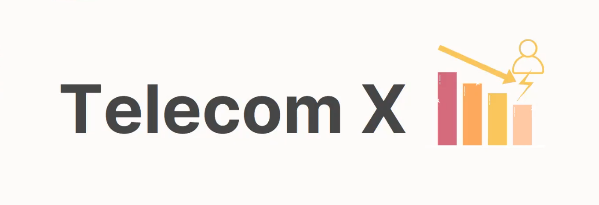

# Challenge Telecom X Análise de Evasão de Clientes

#### O propósito da análise realizada. <= MUDAR

A empresa Telecom X está enfrentando um alto índice de cancelamentos de clientes precisa entender os fatores que estão levando à perda de clientes.

Em um mundo movido por informações, os dados se tornaram um dos ativos mais valiosos para empresas e instituições e atuando como assistente de análise de dados meu trabalho é garantir que esses dados sejam coletados, tratados e analisados da maneira mais eficiente possível para gerar insights estratégicos e ajudar na tomada de decisões inteligentes. 

A partir dessa análise, a empresa poderá avançar para modelos preditivos e desenvolver estratégias para reduzir a evasão.

#### Estrutura do projeto e organização dos arquivos.

#### Exemplos de gráficos e insights obtidos.

#### Instruções para executar o notebook.